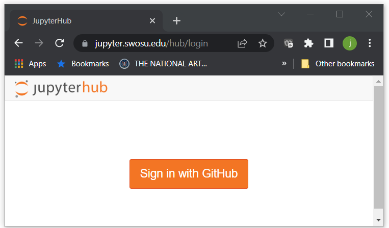

Greetings weary traveler.
Thank you for stopping in.
Some say people want to learn about programming.
They say, "Python is easier to get started with."
Rumor has it that, thanks to the ease of development, many powerful libraries exist.
This all may be true, or at least as true as any other rumor.
But who am I to say.

There are many paths, and many things you can take on your journey.
All of these choices have their own costs and rewards.
Time will tell if you have chosen wisely.
Now, if you enjoy using massive resources and dislike installing software on your own machine, a remote Jupyter notebook might be right for you.
There are several such resources available, but I will share one I have built for travelers such as yourself.
[//]: # (This is a great place to plug the Nautilus system and the GPN system)
Examples of related systems include https://replit.com/~, https://nautilus.optiputer.net/, and https://jupyterhub.greatplains.net/hub/spawn.

You can see the front door of the system if you visit this address: https://jupyter.swosu.edu/.
Unless you have traveled this way before, you should see the door is quite locked.

